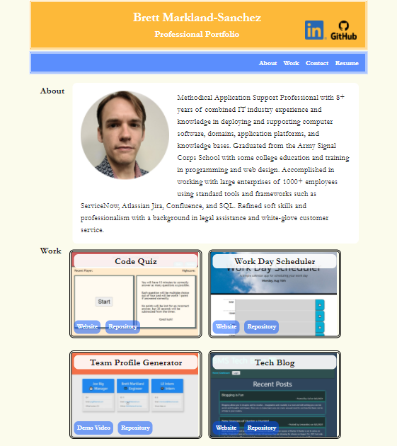

# Brett Markland-Sanchez GitHub.io Page
Showcases my portfolio using GitHub pages to navigate different sections of published work.
#### GitHub Repository: https://github.com/BrettMarkland-Sanchez/BrettMarkland-Sanchez.github.io
#### Deployed Site: https://brettmarkland-sanchez.github.io/
#### Materialize CSS: https://materializecss.com/
## Concept:
```
By utilizing GitHub pages, I am able to host a dynamic web design portfolio.
There are four sections to the page including About, Work, Contact, and Resume.
My professional information is provided with examples of work and page links.
Contact details and a resume download are offered at the bottom.
```
## Contact Details:
**Brett.MarklandSanchez@gmail.com**<br>
**(404)-754-1929**<br>
**Georgia Tech Research Institute**<br>
**Smyrna, GA**<br>

## Screenshots:
### Homepage

